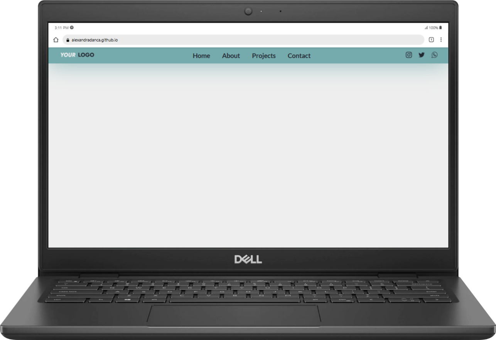
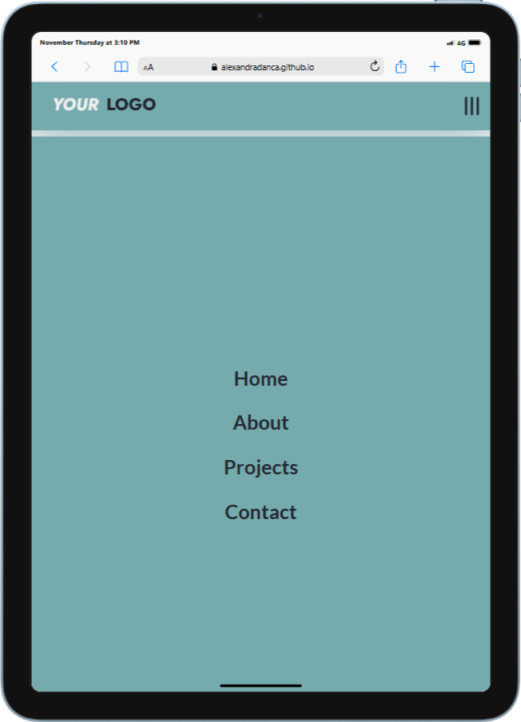

<h2 align="center">
  <a href="https://alexandradanca.github.io/Navbar/" target="_blank">Navbar section</a>
</h2>

A clean and responsive navigation bar to enhance website usability and accessibility.  It was created during front-end learning journey

## Built With
- HTML
- CSS
- JavaScript

## Features

**🎨 Styled just with CSS**

**📱 Fully Responsive**

<h2>Mockup</h2>

 
  
  

<h2>Mockup mp4</h2>

  

https://github.com/user-attachments/assets/30c31708-c9e7-48c7-9ea0-1db897f6d9e3

